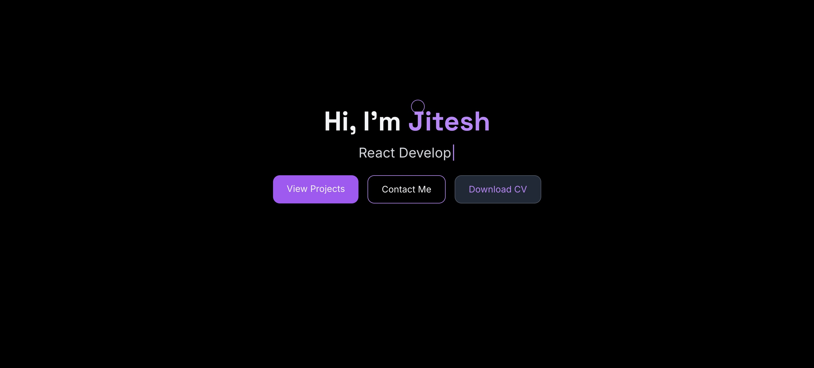
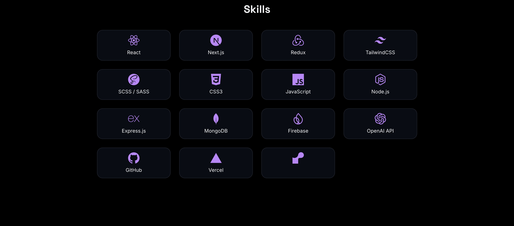
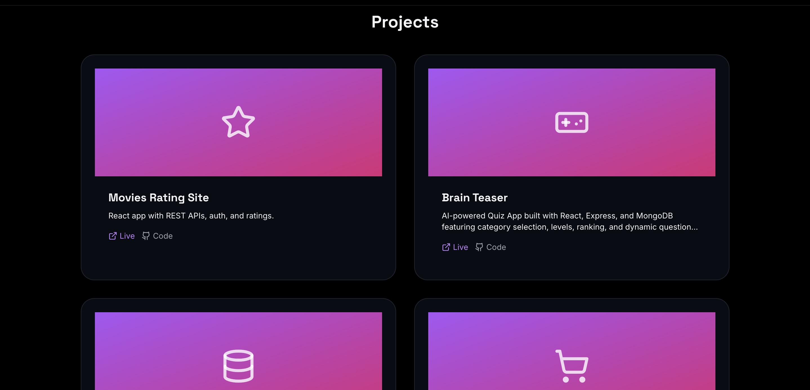

# 🚀 Jitesh.dev — My Personal Portfolio Website

  

> A modern, minimal & sleek **developer portfolio** built using ⚡ React + 🌀 Tailwind CSS — fully responsive and optimized for performance.

---

## 🧑‍💻 About This Project

This is my **personal developer portfolio** showcasing:
- ✨ My skills & experience  
- 💼 Projects I’ve worked on  
- 📝 Resume & contact information  
- 🌙 Light/Dark mode toggle  
- 📬 Contact form integrated with EmailJS  

It’s designed to be **clean, fast, and visually stunning**, with smooth animations and glassmorphism effects.

---

## 🛠️ Tech Stack

| Technology              | Description                           |
|--------------------------|-----------------------------------------|
| ⚛️ **React**              | Frontend framework                     |
| 🌀 **Tailwind CSS**        | Utility-first CSS framework            |
| ☀️ **Dark Mode**          | Toggle system using React hooks        |
| 📩 **EmailJS**            | For sending emails directly from site |
| 🖼️ **Vite**               | Lightning fast build tool             |

---

## ✨ Features

- 🖼️ **Hero section** with animated typewriter effect  
- 📸 **Summary section** with profile photo & about me text  
- 🧠 **Skills section** with interactive stickers  
- 💼 **Projects showcase** with hover effects  
- 🕶️ **Dark mode support** (toggle with Sun/Moon icon)  
- 📨 **Contact form** powered by EmailJS  
- 📄 **Download CV** button  
- 📱 Fully responsive for mobile, tablet, and desktop  

---

## 🧭 Folder Structure

```
Jitesh.dev/
│
├── public/
│   ├── image4.JPG
│   ├── cv.pdf
│   └── favicon.ico
│
├── src/
│   ├── assets/
│   ├── components/
│   │   ├── common/
│   │   ├── layout/
│   │   └── sections/
│   ├── hooks/
│   ├── App.jsx
│   └── index.css
│
└── package.json
```

---

## ⚡ Installation & Setup

```bash
git clone https://github.com/yourusername/Jitesh.dev.git
cd Jitesh.dev
npm install
npm run dev
```

Your portfolio will now be live on `http://localhost:5173` 🚀

---

## ☁️ Deployment

This project is deployed using **[Vercel](https://vercel.com)**.  

---

## 📸 Preview

| 🖼️ Hero Section | 🧑‍💻 Skills | 💼 Projects |
|-----------------|-------------|-------------|
|  |  |  |

---

## 📬 Contact Me

📧 **Email:** your-email@example.com  
🌐 **Portfolio:** [Jitesh.dev](https://jitesh-dev-seven.vercel.app/ )  
💼 **LinkedIn:** [Jitesh Pal](https://www.linkedin.com/in/jitesh-pal-1484a7236/)  
🐦 **Gmail:** [Jitesh Pal](Jiteshpal2604@gmail.com)

---

## 🛡️ License

This project is licensed under the [MIT License](LICENSE).

---

## 🌟 Acknowledgements

- [Tailwind CSS](https://tailwindcss.com)  
- [Vite](https://vitejs.dev)  
- [EmailJS](https://www.emailjs.com)  
- [Lucide React Icons](https://lucide.dev)  

> 💖 _Built with passion by **Jitesh Pal**_
